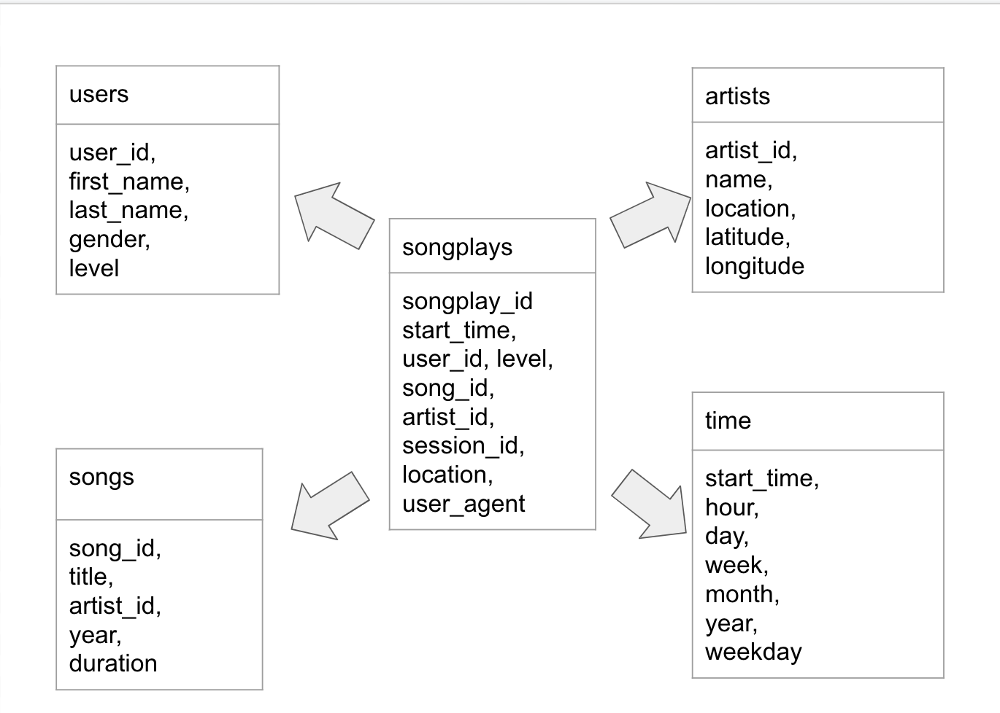

## Sparkify Data Lake

A music streaming startup, called Sparkify, has continued to grow their user base and has decided to migrate from a warehouse to a data lake. Their data, log data for activity on the app and song metadata, is currently located in S3. The objective of this task is to create an ETL pipeline that extracts that data from S3, processes it using Spark, and then loads the data back into Spark as dimensional tables. This format will allow our analytics team greater control over the data and the questions they want to answer. 

## Datasets

The two datasets that are located in S3 are:
  * Song data: s3://udacity-dend/song_data
  * Log data: s3://udacity-dend/log_data
  
The finalized data will be in a star schema format:

## Overview of Files

  * etl.py -> this script will read data from S3, process the data using Spark, and write it back to S3
  * dl.cfg -> this file contains AWS credentials and final location

## Quick Start

1. Download credentials from AWS.
2. Input credentials into dl.cfg file.
3. run python etl.py